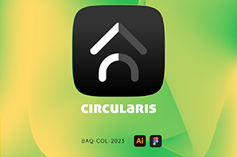
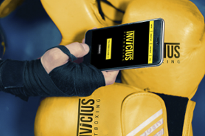

# Portafolio de Gustavo Gomez

Este es mi sitio web personal que muestra mi portafolio de trabajo como diseñador visual. Aquí, puedes encontrar una variedad de proyectos que he realizado en diferentes áreas de diseño gráfico.

## Tecnologías Utilizadas

En este sitio web, he utilizado las siguientes tecnologías:

- [HTML](https://developer.mozilla.org/en-US/docs/Web/HTML): El lenguaje de marcado estándar para la creación de páginas web.
- [CSS](https://developer.mozilla.org/en-US/docs/Web/CSS): Utilizado para dar estilo y diseño a las páginas web.
- [Bootstrap](https://getbootstrap.com/): Un marco de diseño CSS de código abierto que facilita la creación de sitios web receptivos y con un aspecto profesional.
- [Sass](https://sass-lang.com/): Un preprocesador CSS que me permite escribir estilos de manera más eficiente y modular.

## Capturas de Pantalla

*Flipcard que muestra branding de proyecto UX/UI APP 1.*

*Flipcard que muestra branding de proyecto starup 2.*

## Cómo Ver el Sitio Web

Puedes acceder al sitio web en [Ver repositorio en GitHub/](gusgocas.github.io/miprimerrepo/).

## Cómo Contribuir

Si tienes alguna sugerencia o comentario sobre mi trabajo o el sitio web, ¡no dudes en abrir un problema o enviar una solicitud de extracción!

Espero que disfrutes explorando mi portafolio.
